# Radar Demonstrator Architecture

This document records the current direction for a public AI-assisted
model-based design reference project. The architecture is deliberately
provisional: unresolved radar requirements must be settled before an
implementation is treated as a reference design.

## Scope

The radar is a demonstrator for the workflow, rather than the primary mission
system. The intended processing boundary is from ADC samples through a
detection list. Tracking and classification are outside the current scope.

## Agreed decisions

Related decisions: [ADR 0002](../adr/0002-radar-demonstrator-scope.md),
[ADR 0003](../adr/0003-stage-floating-point-fixed-point-simulink.md),
[ADR 0004](../adr/0004-separate-json-driven-stimulus-generation.md),
[ADR 0005](../adr/0005-define-the-dut-from-adc-to-target-list.md),
[ADR 0006](../adr/0006-limit-the-mvp-propagation-model.md),
[ADR 0007](../adr/0007-adopt-3ghz-16x4-half-wave-array-baseline.md), and
[ADR 0008](../adr/0008-defer-hdl-generation-and-cosimulation.md).

- Develop a floating-point MATLAB reference first, followed by fixed-point
  design and analysis, and then a Simulink representation.
- Use a real 16-bit ADC for each channel.
- Use a pulsed LFM chirp as the stimulus waveform.
- Use a 3 GHz carrier. This gives an approximate wavelength of 0.1 m and
  half-wavelength element spacing of approximately 0.05 m.
- Use the accepted 16×4 single-panel array baseline, with 16 horizontal
  azimuth elements and 4 vertical elements; see [ADR 0007](../adr/0007-adopt-3ghz-16x4-half-wave-array-baseline.md).
- Use a single coherent boresight transmit beam for the MVP. Transmit scan and
  the method for illuminating the provisional 90° sector remain undecided.
- At 3 GHz and approximately 0.05 m half-wave spacing, the horizontal
  center-to-center aperture span is 15 × 0.05 m = 0.75 m. This is an aperture
  span, not a claim about the physical panel width.
- Assume an unobstructed free-space path for the MVP, with no terrain, line of
  sight/occlusion, or terrestrial-clutter modeling.
- Keep signal generation in MATLAB. Drive it with a JSON target scenario
  containing RCS in m², Cartesian position, and velocity; save generated test
  vectors in MAT files.
- Include DDC and decimation, fast-time and slow-time processing, CFAR,
  simple clustering, and conversion to a detection list in the DUT boundary.
- Defer HDL work.

## Accepted MVP requirements

- Maximum instrumented range is 100 km; the primary case is a constant-RCS
  10 m² target at 100 km and approximately 800 km/h radial speed.
- Native unambiguous radial velocity is at least ±40 m/s. Range ambiguity must
  also be resolved, and true velocity must be reported after unfolding through
  ±800 km/h.
- CA-CFAR over range-Doppler cells is the first detector. Monte Carlo trials
  estimate Pd and per-cell Pfa with confidence bounds, targeting Pd ≥ 0.9 and
  Pfa ≤ 10^-6.
- An ideal mid-range, high-input-SNR test resolves two moving equal-RCS targets
  with shared nonzero radial velocity, separated by 50 m in range, and emits two
  detection-list reports. Additional velocity-separated and
  unfolded-velocity cases are required.
- Azimuth and elevation receive beamforming are simultaneous; elevation does
  not scan. Boresight angle accuracy is the first acceptance case.
- A 90° azimuth sector (±45°) and one-second sector update are provisional
  timing/coverage goals, not established ±45° performance requirements, until
  illumination and steering are established.
- A configurable near-zero-Doppler band removes static clutter. Its cutoff is
  unresolved; stationary and near-zero-radial-speed targets are out of scope.
- Radar-configuration JSON is authoritative for reproducible waveform, array,
  RF/ADC, processing, scan, blanking, and random-seed parameters. A separate
  target-scenario JSON contains the target list. Test vectors record exact
  radar-configuration and target-scenario versions. The DUT output is a
  detection list with range, radial velocity, azimuth, elevation, and a
  documented detection statistic.

These decisions are recorded in [ADR 0009](../adr/0009-radar-mvp-acceptance-and-ambiguity-requirements.md),
with the separability and waveform/rate candidates updated by [ADR 0012](../adr/0012-adopt-50m-separability-and-narrowband-ddc-candidate.md)
and [ADR 0013](../adr/0013-adopt-150msps-50mhz-if-and-direct-adc-stimulus.md).

## Provisional proposals

- The current waveform/DDC candidate is a 10 MHz complex chirp spanning -5 to
  +5 MHz, a 50 MHz IF center, and multistage decimation from 150 MS/s real ADC
  samples through 50 MS/s complex to 12.5 MS/s complex. The nominal range
  resolution is approximately 15 m; sampled separation, filter response, and
  two detection reports remain WP6b/WP8 acceptance work under [ADR 0012](../adr/0012-adopt-50m-separability-and-narrowband-ddc-candidate.md).
- Use the following scenario assumptions: 0.05 m² drone, 2 m² helicopter,
  5 m² small jet, and 10 m² large jet.

These proposals describe an initial demonstrator direction. They do not define
complete array, waveform, detection, or performance requirements.

## Beam-pattern study

The [beam-pattern study plot](../../evidence/beam-pattern-study.png) and
[MATLAB source](../../evidence/beam_pattern_study.m) were run through MATLAB MCP
on R2026a Update 5. The study is an ideal 16×4 half-wave-spaced isotropic array
azimuth cut. It uses the 16 horizontal elements for azimuth and compares
uniform and Hamming weighting while steering to 0°, +45°, and +60°. Each curve
is independently peak-normalized in an ideal isotropic, uncoupled array-factor
model, so the study does not show scan loss, element pattern, or mutual
coupling.

Analytic model results give approximate 3 dB widths for uniform weighting of
6.36° at 0°, 9.02° at +45°, and 12.99° at +60°. Hamming weighting gives 9.74°,
13.88°, and 20.58° at those steering angles. These results indicate that an
approximately 5° width is optimistic for this study configuration. The results
are analytic model outputs, not coverage or detection acceptance criteria; the
90° azimuth sector remains provisional pending performance requirements and
evaluation.

## Processing boundary

The planned data flow is:

1. MATLAB generates waveform and scenario-driven test vectors, recording exact
   configuration and scenario versions.
2. ADC inputs provide digitized samples for each channel.
3. The DUT applies DDC and decimation.
4. Fast-time processing produces per-pulse range data. Before coherent
   slow-time processing, those results receive migration-aware alignment or
   handling for the moving-target hypotheses under consideration. Slow-time
   processing then forms Doppler data from the usable pulse ensemble for each
   azimuth look.
5. CFAR produces detections, simple clustering groups them, and the DUT emits a
   detection list.

The proposed signal chain and its current rate boundaries are shown below.
The RF/stimulus path is external to the DUT; the DUT boundary begins with the
ADC samples. Fast-time/range processing precedes slow-time/Doppler processing.
A Doppler map for an azimuth look is formed only after the usable pulses for
that look are available and migration-aware alignment or handling has been
applied for the relevant candidate hypotheses. Implementations may stream and
accumulate per-pulse fast-time results while the look is being collected.
Whether alignment uses candidate true-velocity hypotheses, iteration, or
another approved method, along with the exact sequencing, remains WP4 work.

```mermaid
flowchart LR
    GEN["MVP target generator<br/>direct 64-channel ADC vectors<br/>3 GHz RF phase model"] --> ADC["DUT input: 64 real 16-bit ADC channels<br/>150 MS/s/channel; 50 MHz IF"]
    ADC --> DDC["Multistage DDC<br/>complex mix/filter + /3 to 50 MS/s<br/>filter + /4 to 12.5 MS/s"]
    DDC --> BB["Complex baseband candidate<br/>12.5 MS/s/channel; Nyquist +/-6.25 MHz"]
    BB --> FT["Fast-time/range processing<br/>10 MHz waveform; nominal ~15 m resolution"]
    FT --> ST["Migration-aware alignment/handling<br/>then slow-time/Doppler processing<br/>usable fast-time pulse results for each azimuth look;<br/>five approximate PRFs: 1700, 1900, 2150, 2450, 2700 Hz<br/>128 usable returns targeted per PRF"]
    ST --> RD["Range-Doppler feature formation<br/>aligned pulse ensemble to Doppler map"]
    RD --> BF["Azimuth/elevation receive beamforming"]
    BF --> AR["Multi-PRF ambiguity resolution<br/>+ post-unfolding near-zero-Doppler clutter veto"]
    AR --> CFAR["Range-Doppler CA-CFAR"]
    CFAR --> CL["Simple clustering"]
    CL --> DL["Detection list<br/>range, radial velocity, azimuth,<br/>elevation, detection statistic"]

    subgraph DUT["DUT boundary: ADC samples to detection list"]
        ADC
        DDC
        BB
        FT
        ST
        RD
        BF
        AR
        CFAR
        CL
        DL
    end
```

<!-- markdownlint-disable MD013 -->

<!-- markdownlint-enable MD013 -->

The generator abstracts the 3 GHz RF waveform and analog conversion; it emits
sampled 50 MHz IF directly with coherent delay, Doppler, and array phase. The
five-PRF set and 128-return count are simulation targets that remain
subject to G2 verification; 128 usable pulses per PRF per azimuth look is a
scheduling target, not verified performance. The diagram does not freeze the
sampled DDC implementation, DSP interfaces, or the full transition schedule.
The 50 MHz IF is distinct from the 50 MS/s complex intermediate; a real-only /3
followed by IQ recovery is rejected because it aliases the IF to DC. G2 must also
verify filter alias rejection, transient and group-delay handling, decimator
phase across PRIs, and near-range gating: the 6.80 km lower range edge is only
about 0.365 us beyond the 40 us blanking plus 5 us guard.

The exact algorithms, interfaces, rates, units, and numerical settings remain
open unless stated above as an agreed decision.

## G2 and downstream items still open

- Can the G1 50 MHz IF, 150 MS/s ADC rate, PRF set, pulse count, and
  processing schedule produce 128 usable returns per PRF with the specified
  blanking, guard, priming, and transitions?
- What look spacing follows from the ideal 3 dB beamwidth, and what noisy
  angle, elevation-sector, Doppler-error, and velocity tolerances apply?
- What clutter cutoff and detection-statistic definition make results
  reproducible, including Monte Carlo trial and confidence methods?

WP2's bounded simulation baseline passed the historical G1 review on 2026-09-14;
see [ADR 0011](../adr/0011-adopt-v1-simulation-timing-baseline.md) and the
[feasibility report](../research/radar-v1-feasibility.md). [ADR 0014](../adr/0014-adopt-revised-v1-analytic-simulation-baseline.md)
accepted revised G1 for WP3 data contracts and WP4 DSP/timing architecture.
WP3 and WP4 are therefore the next work packages, with G2 required to prove
the full return, filter, priming, and transition schedule before those
contracts are accepted.
