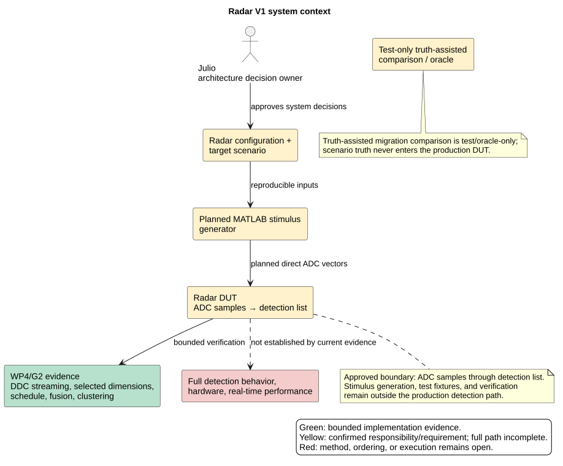
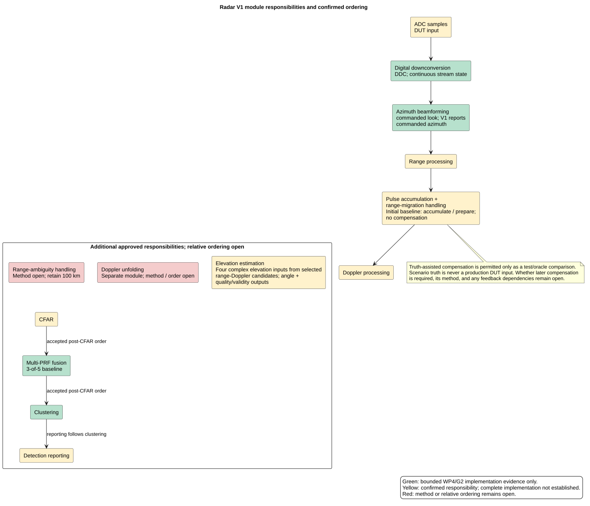
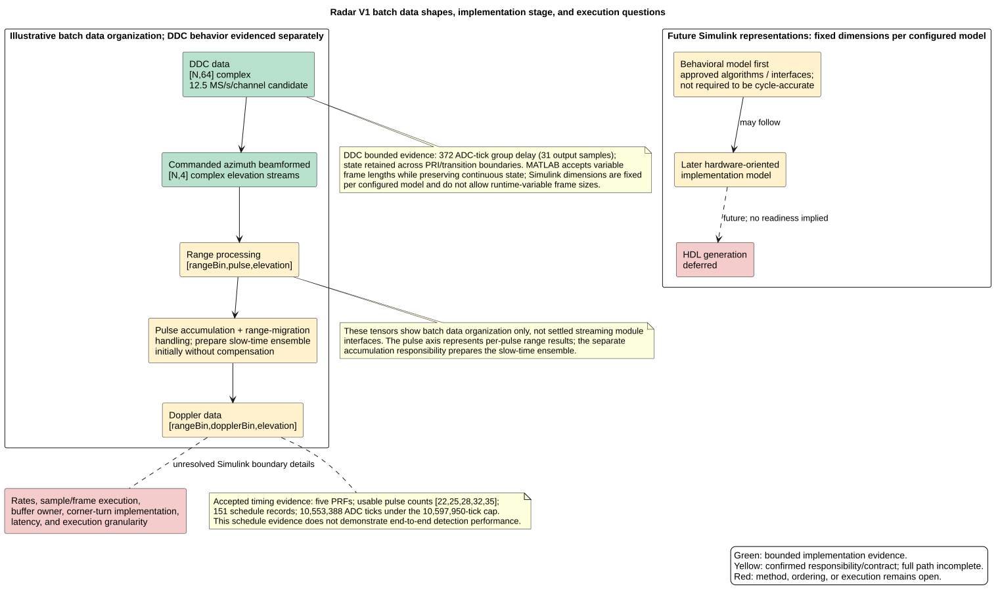

# Radar V1 architecture overview

**Review status:** The documents passed independent semantic review on
2026-09-26. The architecture responsibilities below reflect Julio’s confirmed
shared understanding as of that date. Internal interfaces, unresolved ordering,
and execution details remain open; Julio's visual review of the redrawn diagrams
is pending.

## Purpose and audience

These views give Julio and project contributors a readable map of the radar
system boundary, approved module responsibilities, bounded implementation
evidence, and remaining decisions. They document confirmed choices without
selecting unresolved algorithms, interfaces, or execution topology.

## Status legend

- **Green — Bounded implementation evidence:** independently verified within
  WP4/G2 scope. Green does not mean the full receiver is implemented.
- **Yellow — Confirmed responsibility or contract:** approved direction whose
  complete processing path is not yet implemented or verified.
- **Red — Unresolved:** method, sequence, or execution detail remains open.

## System context



Julio confirmed the device-under-test (DUT) boundary from ADC samples through
the detection list. Stimulus generation, test fixtures, verification, and
provenance remain outside the production detection path. Truth-assisted range
migration compensation may be used only as a test or oracle comparison; scenario
truth is never a production DUT input. The complete ADC-to-detection reference,
hardware behavior, and real-time performance are not established.

## Module responsibilities and ordering



Separate modules are confirmed for digital downconversion (DDC) and commanded-
look azimuth beamforming; V1 reports the commanded azimuth. Range processing,
pulse accumulation/range-migration handling, Doppler processing, range-ambiguity
handling, Doppler unfolding, CFAR, multi-PRF fusion, clustering, elevation
estimation, and detection reporting are distinct responsibilities.

The initial accumulation/migration baseline accumulates and prepares pulse
ensembles without range-migration compensation. Whether later compensation is
required remains open. Range-ambiguity handling retains the 100 km coverage
requirement; its method is open. Selected-range waveform diversity is a candidate
study, and any coverage reduction requires a separate decision.

Solid arrows through Doppler processing show the confirmed front-end baseline
progression. For downstream processing, the only fixed partial order shown is
**CFAR → multi-PRF fusion → clustering → detection reporting**. Range-ambiguity
handling, Doppler unfolding, and elevation estimation are shown as
responsibilities without inventing their full relative order. The batch shapes
in the data view illustrate data organization; they do not define streaming
module interfaces. The pulse axis represents per-pulse range results before the
separate accumulation responsibility prepares a slow-time ensemble. Elevation
estimation receives four complex
elevation-channel values from selected range-Doppler candidates and produces
angle plus quality/validity outputs. V1 uses commanded azimuth. Elevation
quality/validity semantics remain to be defined.

## Data and execution views



The current MATLAB reference supports variable-length frames while preserving
continuous DDC state. Future Simulink models use fixed dimensions per configured
model and do not support runtime-variable frame sizes. Build a behavioral
Simulink model first; a later hardware-oriented implementation model may follow.
HDL generation remains deferred.

Simulink rates, sample-versus-frame execution, buffer ownership, corner-turn
implementation, latency, and execution granularity remain open. Buffering once
per PRI is only a hypothesis. Pulse accumulation and corner turning are distinct:
accumulation gathers successive pulses into a slow-time ensemble; corner turning
reorders data for range-wise Doppler processing.

Bounded WP4/G2 evidence includes DDC streaming and delay, receive dimensions,
the five-PRF schedule, post-CFAR 3-of-5 fusion, and clustering contract behavior.
The schedule is evidence for its frozen timing contract, not for end-to-end
detection performance. The complete production-like floating-point reference
remains unfinished.

## Terms

- **ADC:** analog-to-digital converter.
- **CFAR:** constant false alarm rate detector.
- **DUT:** device under test; here, the production processing boundary from ADC
  samples through the detection list.
- **DDC:** digital downconversion.
- **PRF / PRI:** pulse repetition frequency / pulse repetition interval.
- **Slow time:** successive pulse observations within a coherent processing
  interval.
- **Corner turning:** transposition/reordering of data for an access pattern;
  it is not matrix inversion.
- **Fusion:** combines per-PRF binary decisions while retaining five-layer
  validity, support, pass, and source-cell information.
- **Clustering:** connected components using eligible, same-look, one-cell
  Chebyshev adjacency, without edge wrapping or invalid bridging.

## Read-only review questions

1. Do the confirmed module responsibilities match the intended architecture?
2. Which module interfaces need to be made explicit before component work?
3. What evidence should decide whether range-migration compensation is needed?
4. Which range-ambiguity and waveform-diversity cases should the candidate study
   compare while retaining 100 km coverage?
5. What should own the Simulink buffers, and what rates, granularity, and latency
   should be specified at each boundary?
6. What semantics should elevation quality/validity carry, and where should
   elevation results join detection reporting?

## Sources and rendering

The confirmed responsibilities are recorded in [ADR 0019](../adr/0019-adopt-human-led-module-design-and-simulink-staging.md),
[ADR 0020](../adr/0020-adopt-pilot-adc-storage-and-sample-integrity.md), and
[ADR 0021](../adr/0021-adopt-dsp-responsibilities-and-ambiguity-baseline.md).
Independent semantic review of these ADRs and this overview passed on
2026-09-26 with no unresolved findings. Julio's visual review of the redrawn
diagrams remains pending. The scoped
WP4/G2 baseline and evidence are documented in
[`architecture.md`](architecture.md), [ADR 0017](../adr/0017-adopt-v1-commanded-look-receive-processing-and-g2-schedule.md),
[ADR 0018](../adr/0018-freeze-wp4-g2-phase0-contract.md), and
[`CURRENT.md`](../../CURRENT.md). The chain in `architecture.md` is historical;
it does not define current end-to-end module order. See ADR 0021 and this
overview for current approved responsibilities and unresolved ordering. The
updated responsibilities and open
interfaces are recorded in the project human-led development plan at
[`docs/plans/human-led-development.md`](../../docs/plans/human-led-development.md).

PlantUML sources and their SVG previews are supplied together in [`diagrams/`](diagrams/).
With Java, Graphviz (`dot`), and PlantUML 1.2026.8 available, rerender from the
repository root:

```sh
plantuml -tsvg docs/architecture/diagrams/context.puml \
  docs/architecture/diagrams/processing.puml \
  docs/architecture/diagrams/data-timing.puml
```
