# DDC walkthrough

These diagrams follow the current MATLAB implementation. Solid arrows in the
algorithm view show sample flow; dashed arrows in the state view show state
carried between `processFrame` calls.
The algorithm view is for readers learning the implemented DDC, and the state
view explains why splitting a frame preserves the same output stream. Each
channel uses the same oscillator definition and FIR coefficients, with its own
FIR delay state. State belongs to one initialized processing run.





The algorithm view maps to [signal and state](#follow-the-signal-and-state)
and [stimulus](#run-the-example). For each real input tone, the mixer translates
both frequency components. The positive-frequency components move as
`51 MHz → +1 MHz` and `70 MHz → +20 MHz`; stage 2 attenuates the latter. The
state view maps to the two-frame comparison and reset experiments in
`runDdcWalkthrough`.

This MATLAB example follows a synthetic, one-channel ADC stream through the
existing floating-point digital down-converter (DDC). It demonstrates complex
frequency translation, two FIR stages, decimation, and state that must persist
across input frames. MATLAB accepts variable frame lengths and preserves state
across calls; a future Simulink model will use fixed dimensions per configured
model. It teaches selected DDC behavior; it does not verify the
complete radar receiver or establish hardware performance.

## Run the example

Prerequisites are MATLAB and Signal Processing Toolbox, which provides `fir1`
and `kaiser` for the filter coefficients. From the repository root, add the
`examples` folder and call the function:

```matlab
addpath("examples")
results = runDdcWalkthrough();
```

The function runs without creating figures or files and returns a metrics
structure. To save the three PNG figures, pass an output directory; the
function creates it when needed:

```matlab
results = runDdcWalkthrough(fullfile(tempdir, "ddc-walkthrough"));
```

The input is a real double array of shape `[6000, 1]`: 6000 consecutive ADC
samples in one channel. It sums two cosines, each present for the full record:
a 51 MHz tone with normalized amplitude 1.0 and a 70 MHz probe with amplitude
0.2. The sample rate is 150 MS/s. Amplitude is arbitrary and normalized for
this experiment; it is not ADC volts or a declared ADC full-scale value. The
DDC mixes with a negative 50 MHz complex oscillator, so the 51 MHz tone moves
to +1 MHz complex baseband. With no factor of two in the mixer, the real
cosine's positive-frequency component has amplitude 0.5 after translation.
The 70 MHz probe lies outside the accepted 45–55 MHz ADC input band and is
included only as a pedagogic out-of-band probe; it is also outside the final
±5 MHz baseband passband.

The example processes the same stream as one call and as two frames split after
sample 1001: the first frame contains 1001 samples and the second contains
4999. It compares both paths against each other and compares uninterrupted
processing with a causal-convolution oracle. The oracle truncates each FIR's
full convolution to the causal input-record length before applying that stage's
decimation. When run, the function prints the measured maximum absolute errors
and checks them against its `2e-12` tolerance; the exact values depend on the
MATLAB execution and are intentionally not asserted here. This input produces
a `[500, 1]` complex output array at 12.5 MS/s.

The recorded MATLAB run on 2026-09-27 produced a one-shot/oracle maximum
absolute error of `0`, a split/one-shot maximum error of `5.5531e-16`, and a
`2e-12` tolerance. Resetting only the oscillator count produced the expected
−120° settled phase with `1.3145e-11°` phase error and amplitude ratio `1`.
Resetting only stage-one filter history produced a `0.3983` maximum transient
error in the boundary window and settled to `5.5531e-16`. These values document
one run of this deterministic example, not broad performance or requirement
coverage.

## Follow the signal and state

The input shape is `[N, C]`: rows are successive ADC ticks and columns are
channels. The demonstration uses `C = 1` and double-precision values. Mixing
produces complex samples at 150 MS/s. Stage 1 is a 24th-order, 25-tap FIR with
a 25 MHz cutoff, designed as a two-sided low-pass filter around zero. It runs
at 150 MS/s, then keeps every third output, yielding 50 MS/s. Stage 2 is a
240th-order, 241-tap FIR with a 5.625 MHz cutoff; it selects the desired
approximately ±5 MHz baseband before keeping every fourth output, yielding
12.5 MS/s. The decimation factors are `/3` and `/4`; the combined rate change
is `/12`. Rates are samples per second, while frame lengths are counts of
samples.

`radardemo.ddc.initializeState` creates zeroed FIR filter-state buffers and
zero-based decimation phase counters. The buffers hold the filter's internal
delay state across calls; they are not literally a copy of the raw past input
samples. The phase counters preserve the `/3` and `/4` selection positions
when a frame ends between selected samples. `inputSampleCount` preserves the
complex oscillator phase. The implementation's output coordinate starts at
selected tick 0; the nominal group delay does not discard samples or shift that
coordinate. Resetting only this counter at the 1001-sample
boundary produces a persistent settled phase offset of −120° in this setup.
Resetting only the stage-one FIR state produces a temporary boundary transient
that settles after the cascade's memory span. The function reports the measured
phase and transient errors when run.

The live function is named `processFrame`. Some historical serialized fixture
metadata retains the field names `chunkLengths` and `maxChunkSamples`; those
names preserve recorded provenance and do not identify the live API. The
symmetric FIR cascade has a
nominal group delay of 372 ADC ticks, equal to 31 output periods because each
output period spans 12 ADC ticks. The cascade's
full memory span is 744 ADC ticks. Group delay describes the nominal shift of
the filtered waveform; memory span describes how long prior filter history can
affect outputs. They answer different timing questions. Startup filter state
is zero, so early outputs include the causal filter's startup transient.

At a 1001-sample split, the second call resumes the returned `inputSampleCount`,
both FIR delay buffers, and the `/3` and `/4` phase counters. Frame output
lengths depend on the frame length and incoming phase; the total output for the
complete stream is 500 samples in this example. Each real cosine also has a
negative-frequency component, which the mixer translates. The low-pass cascade
attenuates components outside its baseband; the 70 MHz probe is illustrative,
not a complete model of the
receiver's frequency response.

## Figures and interpretation

Passing an output directory creates these figures:

- [Frame timing](assets/ddc-timing.png) marks ADC ticks, stage-one selected
  ticks, final output ticks, the frame boundary, and nominal group delay.
- [Input and output spectra](assets/ddc-spectra.png) shows the complex mixer
  output and signals after each decimating filter stage.
- [Boundary errors](assets/ddc-boundary-errors.png) compares the normal split
  with uninterrupted processing and shows the two intentional state-reset
  experiments.

The spectra use FFT magnitudes normalized by record length, in dB relative to
unit amplitude. The boundary plot uses error magnitude relative to unit
amplitude. These are diagnostic observations for this synthetic input and
configuration. They do not establish detection performance, hardware or
real-time behavior, complete FIR precursor/waveform retention, or verification
of all applicable requirements. The DDC is one part of the processing path in
[RAD-V1-002](../requirements/radar-matlab-v1.md#requirements); the sampling and
nominal rate chain are described by
[RAD-V1-023](../requirements/radar-matlab-v1.md#requirements). This walkthrough
provides focused evidence about selected DDC behavior, not full verification
of either requirement.
