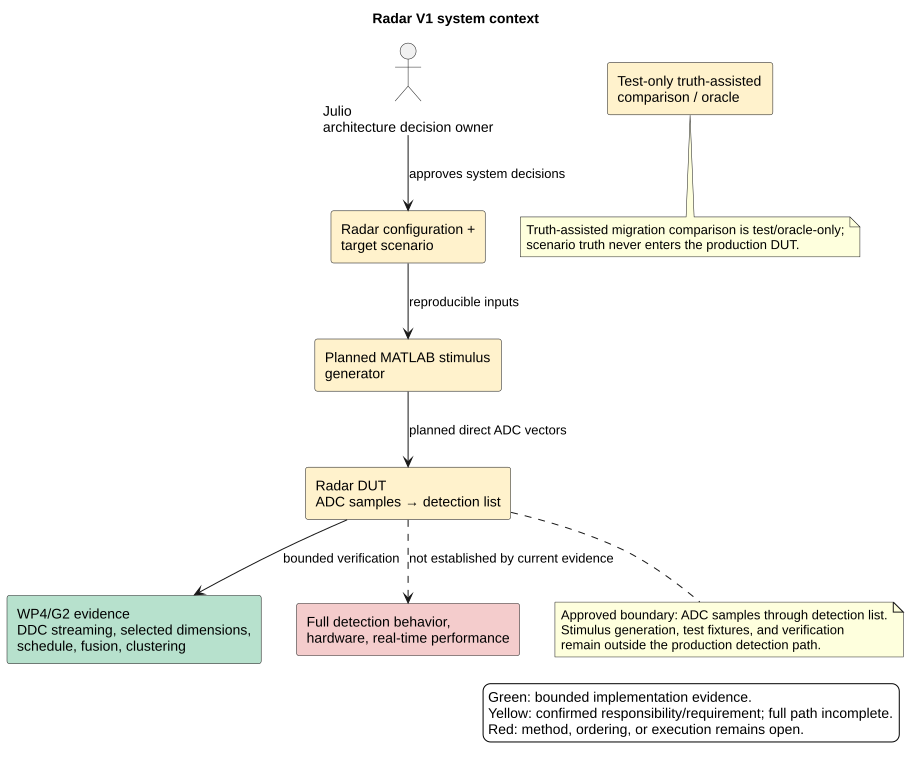
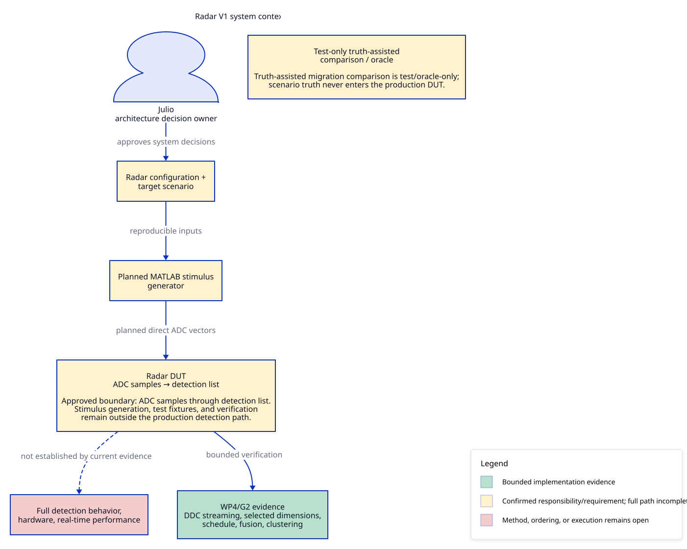

# D2 context view comparison

## Evaluation conditions

- Branch: `d2-context-evaluation`, based on
  `2389af89f05adf058b0939fe7a62a8cbfe2a8ab1` (`2389af8`).
- PlantUML source: `docs/architecture/diagrams/context.puml` at base commit;
  Git blob `9f84b0db52ffc10615b95e79ade2da4f47f2c1f7`, SHA-256
  `8e76b0717537abaed8228d32d9b2ba758160cfb1a0823e57690860bb59d3b2c6`.
- Host: macOS 26.6.2, Darwin arm64.
- D2: v0.9.0 from Homebrew at `/opt/homebrew/bin/d2`; version check was
  `env -u DEBUG /opt/homebrew/bin/d2 version`, output `v0.9.0`.
- Existing renderer stack: PlantUML 1.2026.8 (commit `149874a`), OpenJDK 27,
  Graphviz `dot` 16.1.0 (`20260904.0139`).
- D2 source sets top-to-bottom direction and the existing status fills. Layout
  engine Dagre and theme 0 were defaults. The final render used explicit
  `--pad 20` to reduce outer whitespace.
- Exact render command:

  ```sh
  env -u DEBUG /opt/homebrew/bin/d2 --pad 20 \
    docs/research/d2-diagram-tooling/context.d2 \
    docs/research/d2-diagram-tooling/context.svg
  ```

## Artifacts and semantic check

- D2 source: `docs/research/d2-diagram-tooling/context.d2`.
- D2 SVG: `docs/research/d2-diagram-tooling/context.svg`.
- This comparison: `docs/research/d2-diagram-tooling/comparison.md`.
- The seven existing items are retained: Julio, radar configuration and target
  scenario, planned MATLAB stimulus generator, radar DUT, WP4/G2 evidence,
  truth-assisted test/oracle comparison, and unresolved full detection behavior,
  hardware, and real-time performance.
- All five existing labeled relationships are retained: the four solid links
  and the dashed DUT-to-unresolved-status link.
- Both explanatory notes retain their text and remain visually grouped with the
  oracle and DUT they describe. D2 places note text inside the corresponding
  yellow node; PlantUML renders separate attached note boxes.
- The approved ADC-samples-through-detection-list boundary, the production/test
  separation, green/yellow/red status fills, and all three legend meanings are
  retained. No system node or flow was added.

## Visual and source observations

### Previews

Existing PlantUML preview from the base commit:



D2 v0.9.0 trial preview:



At 918 px wide, matching the existing SVG's intrinsic width, the D2 view is
918 × 735 px; its SVG viewBox is `0 0 1402 1121`. The existing PlantUML SVG is
918 × 760 px. Both fit the overview's normal image width. D2's labels remain
legible in this preview but are noticeably smaller than the PlantUML labels.
Its native legend uses explicit color swatches and sits at the lower right. The
Oracle and DUT notes are readable inside their yellow nodes, but the larger
nodes make those notes less visually distinct than PlantUML's folded callouts.
D2 uses blue borders and connectors while the PlantUML baseline uses black;
this is a style difference, not a semantic change.

The D2 source is 55 lines versus 40 lines for the PlantUML source. D2 expresses
the nodes, links, fills, and legend directly; the two long quoted labels use
escaped newlines, which are less scannable to edit. PlantUML's note syntax keeps
callout text separate. Automatic layout also means positions may shift after
source or renderer changes.

The exact D2 render command was run twice on this host and produced the same
SVG SHA-256 both times:
`8430326c0cf1d97fa3dc2a0c62f6797b9a99cecd1b701c38615ec365a4d45077`.
This demonstrates repeatability for this source, CLI version, and host; it does
not establish identical layout across D2 versions or operating systems.

## Provisional recommendation

Retain PlantUML for this view for now. D2 rendered the same content successfully
and has a compact direct-SVG workflow, but its smaller text and merged note
presentation are tradeoffs for this overview. This is an agent observation from
one isolated view, not semantic or visual approval. Root inspection and
Julio's visual review and adoption decision remain pending.
