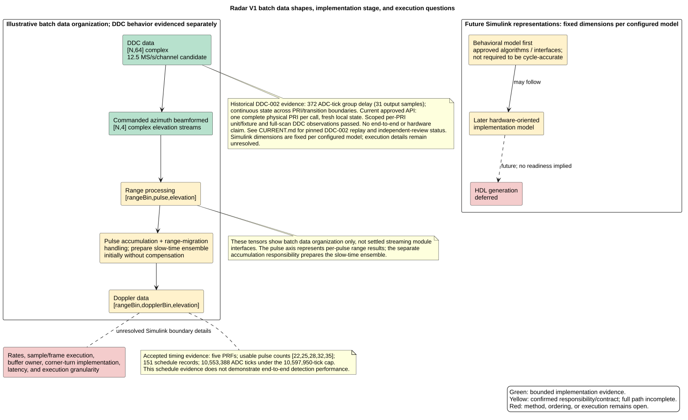
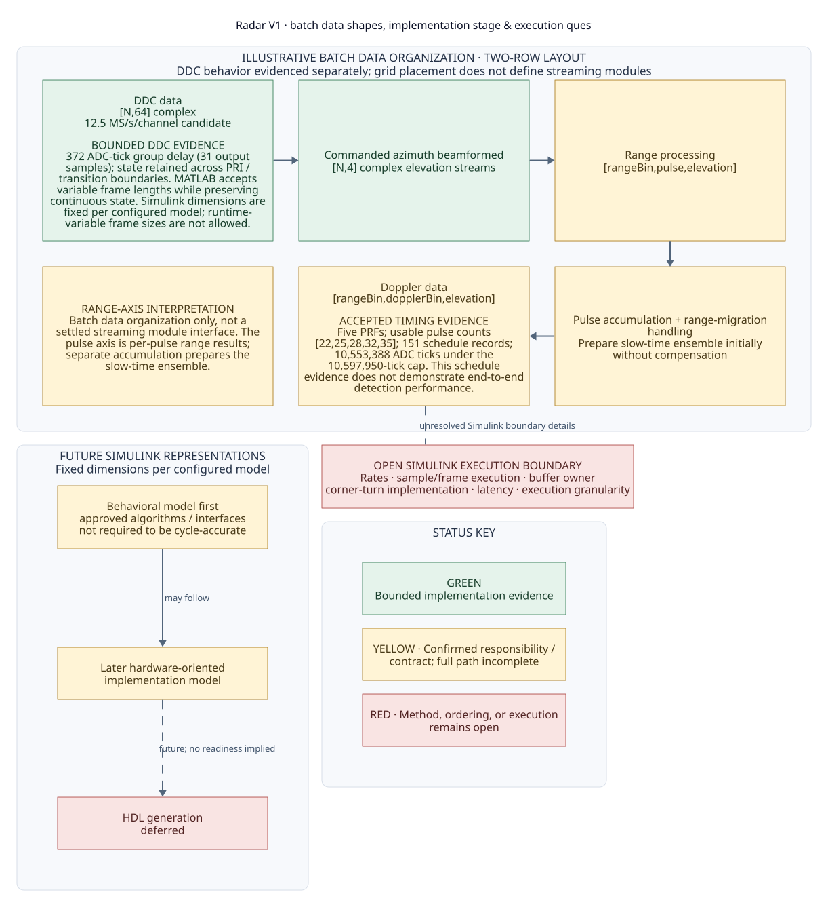

# Radar V1 data timing diagram comparison

## Previews

PlantUML baseline:



D2 v0.9.0, rendered with TALA:



## Fidelity and design

The D2 view preserves the batch data shapes and order, candidate rate, DDC
group delay and state behavior, frame-size distinction, slow-time preparation
caveat, timing schedule counts and tick cap, and the limit that schedule
evidence does not establish end-to-end detection performance. It also preserves
the fixed-dimension Simulink model constraint, behavioral and later
hardware-oriented model distinction, deferred HDL generation, and all open
execution-boundary questions. The batch tensors are explicitly presented as
illustrative organization rather than settled streaming interfaces.

The colors retain the source status meanings: green is bounded implementation
evidence, yellow is a confirmed responsibility or contract with an incomplete
path, and red is an open method, ordering, or execution question. The diagram
does not imply that streaming topology or HDL readiness has been approved.

D2 uses a two-row, three-column grid for the batch stages, nested panels for
future Simulink representations and the status key, and reusable classes for
the evidence states. The range-axis interpretation card explains the pulse-axis
caveat for the range tensor. The grid placement is explicitly a page layout;
it does not define streaming modules. TALA routes from range data down to the
accumulation stage, then back across to Doppler data. The overall render is
slightly taller than it is wide.

## Rendering and previewing

The standalone SVG was rendered with D2 v0.9.0 using this exact command:

```sh
env -u DEBUG /opt/homebrew/bin/d2 --layout=tala --theme=0 --pad 24 \
  docs/research/d2-diagram-tooling/data-timing.d2 \
  docs/research/d2-diagram-tooling/data-timing.svg
```

The source embeds the same TALA layout and neutral theme 0. Markdown Preview
Enhanced has its own `d2Layout`, `d2Theme`, and `d2Path` settings; set them to
match the standalone render before comparing its native D2 preview. Its
explicit layout setting controls the extension render, so the embedded
`layout-engine` value alone may not select TALA in the preview. For this render,
the matching VS Code settings are:

```json
{
  "markdown-preview-enhanced.d2Path": "/opt/homebrew/bin/d2",
  "markdown-preview-enhanced.d2Layout": "tala",
  "markdown-preview-enhanced.d2Theme": 0
}
```

The native D2 fence below is included so the extension preview can be checked
against the adjacent standalone SVG. Open this Markdown file in Markdown
Preview Enhanced after applying the settings above and compare the fenced
render with the SVG. The extension preview itself has not been tested as part
of this comparison.

<!-- markdownlint-disable MD013 -->
```d2
vars: {
  d2-config: {
    layout-engine: tala
    theme-id: 0
  }
}

direction: down
style.fill: "#FFFFFF"
style.font-size: 16

title: |md
  **Radar V1 · batch data shapes, implementation stage & execution questions**
| { near: top-center }

classes: {
  panel: {
    style: {
      fill: "#F7F9FC"
      stroke: "#D7DEE8"
      stroke-width: 1
      border-radius: 10
      font-color: "#253247"
      font-size: 17
    }
  }
  evidence: {
    style: {
      fill: "#E5F3EB"
      stroke: "#4B8B69"
      stroke-width: 1
      font-color: "#173D2A"
      font-size: 16
    }
  }
  confirmed: {
    style: {
      fill: "#FFF4D6"
      stroke: "#B58B35"
      stroke-width: 1
      font-color: "#493A18"
      font-size: 16
    }
  }
  open: {
    style: {
      fill: "#F9E4E3"
      stroke: "#B75C59"
      stroke-width: 1
      font-color: "#522423"
      font-size: 16
    }
  }
  flow: {
    style: {
      stroke: "#52657B"
      stroke-width: 2
      font-color: "#40536A"
      font-size: 13
    }
  }
}

batch: "ILLUSTRATIVE BATCH DATA ORGANIZATION · TWO-ROW LAYOUT\nDDC behavior evidenced separately; grid placement does not define streaming modules" {
  class: panel
  grid-rows: 2
  grid-columns: 3
  grid-gap: 38
  ddc: "DDC data\n[N,64] complex\n12.5 MS/s/channel candidate\n\nBOUNDED DDC EVIDENCE\n372 ADC-tick group delay (31 output\nsamples); state retained across PRI /\ntransition boundaries. MATLAB accepts\nvariable frame lengths while preserving\ncontinuous state. Simulink dimensions are\nfixed per configured model; runtime-\nvariable frame sizes are not allowed." {
    class: evidence
    shape: rectangle
    width: 340
  }
  beam: "Commanded azimuth beamformed\n[N,4] complex elevation streams" {
    class: evidence
    shape: rectangle
    width: 310
  }
  range: "Range processing\n[rangeBin,pulse,elevation]" {
    class: confirmed
    shape: rectangle
    width: 340
  }
  range_note: "RANGE-AXIS INTERPRETATION\nBatch data organization only, not a\nsettled streaming module interface. The\npulse axis is per-pulse range results;\nseparate accumulation prepares the\nslow-time ensemble." {
    class: confirmed
    shape: rectangle
    width: 340
  }
  doppler: "Doppler data\n[rangeBin,dopplerBin,elevation]\n\nACCEPTED TIMING EVIDENCE\nFive PRFs; usable pulse counts\n[22,25,28,32,35]; 151 schedule records;\n10,553,388 ADC ticks under the\n10,597,950-tick cap. This schedule\nevidence does not demonstrate end-to-end\ndetection performance." {
    class: confirmed
    shape: rectangle
    width: 340
  }
  accum: "Pulse accumulation + range-migration\nhandling\nPrepare slow-time ensemble initially\nwithout compensation" {
    class: confirmed
    shape: rectangle
    width: 340
  }
  ddc -> beam -> range -> accum -> doppler: { class: flow }
}

simulink: "FUTURE SIMULINK REPRESENTATIONS\nFixed dimensions per configured model" {
  class: panel
  direction: down
  behavior: "Behavioral model first\napproved algorithms / interfaces\nnot required to be cycle-accurate" {
    class: confirmed
    shape: rectangle
    width: 310
  }
  hardware: "Later hardware-oriented\nimplementation model" {
    class: confirmed
    shape: rectangle
    width: 310
  }
  hdl: "HDL generation\ndeferred" {
    class: open
    shape: rectangle
    width: 310
  }
  behavior -> hardware: "may follow" { class: flow }
  hardware -> hdl: "future; no readiness implied" {
    class: flow
    style.stroke-dash: 6
  }
}

boundary: "OPEN SIMULINK EXECUTION BOUNDARY\nRates · sample/frame execution · buffer owner\ncorner-turn implementation · latency · execution granularity" {
  class: open
  shape: rectangle
  width: 460
}

batch.doppler -- boundary: "unresolved Simulink boundary details" {
  class: flow
  style.stroke-dash: 6
}

legend: "STATUS KEY" {
  class: panel
  direction: down
  green: "GREEN\nBounded implementation evidence" {
    class: evidence
    shape: rectangle
    width: 300
  }
  yellow: "YELLOW · Confirmed responsibility /\ncontract; full path incomplete" {
    class: confirmed
    shape: rectangle
    width: 300
  }
  red: "RED · Method, ordering, or execution\nremains open" {
    class: open
    shape: rectangle
    width: 300
  }
}
```
<!-- markdownlint-enable MD013 -->
